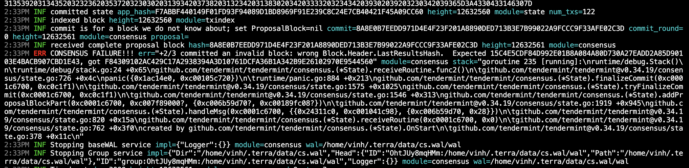

# App hash due to binary commit

On 2 May, there is a report of a problem that is causing app hash error when applying a CosmWasm patch on mainnet columbus - 5.

In summary, there are three causes leading to this app hash problem. Here is how I identify and solve this.

## Terminology

Full read available at [here](https://github.com/tendermint/tendermint/blob/main/spec/core/readme.md)

1. **App hash**: it is a very scary thing, challenges even the most experienced. It indicates that the Cosmos application layer has a problem somewhere. But, where exactly is the problem?

    How app hash verification works? When a block is about to be committed, a state validation will be performed to make sure that current state and next block is compatible with each others. [Code](https://github.com/tendermint/tendermint/blob/main/state/validation.go#L15)

    In our situation, two most occurred errors are `wrong Block.Header.AppHash` and `wrong Block.Header.LastResultsHash`

2. **State**: State is a short description of the latest committed block of the Tendermint consensus. It keeps all information necessary to validate new blocks, including the last validator set and the consensus params. [Code](https://github.com/tendermint/tendermint/blob/main/state/state.go#L48)

3. **Block**: Block defines the atomic unit of a Tendermint blockchain. [Code](https://github.com/tendermint/tendermint/blob/main/types/block.go#L43). A block will contain many transactions. There are two ways a node can have the latest block:
   * Create a new block (when a node is not catching up): [Code](https://github.com/tendermint/tendermint/blob/main/state/execution.go#L94)
   * Fetch blocks from peers into a block pool (when a node is catching up): [Code](https://github.com/tendermint/tendermint/blob/main/blockchain/v0/pool.go#L375)

4. **Blockchain reactor**: [Overview architecture of current reactor v0](https://github.com/tendermint/tendermint/blob/master/docs/architecture/adr-040-blockchain-reactor-refactor.md#context). The Blockchain Reactor's high level responsibility is to enable peers who are far behind the current state of the blockchain to quickly catch up by downloading many blocks in parallel from its peers, verifying block correctness, and executing them against the ABCI application. 

## Debugging

To trace why it has led to the problem, I must first understand what is the error and how this error shows up.

1. How `wrong Block.Header.AppHash` happens? 

    block.AppHash and state.AppHash is not equal in bytes to each others. It will lead to app hash error.

    Where does state.AppHash come from? [Code](https://github.com/tendermint/tendermint/blob/main/state/execution.go#L191). The result of executing latest block txs againts the application (a Cosmos app), is then committed into db which returns app hash.
    * [Tendermint Commit State](https://github.com/tendermint/tendermint/blob/main/state/execution.go#L211): this will shoot the ABCI Commit message to Cosmos app.
    * [Cosmos Commit State](https://github.com/cosmos/cosmos-sdk/blob/main/baseapp/abci.go#L458): this will fetch the root data hash of current store (AppHash) (after current block txs have been executed, modified store) and returns it to Tendermint side.

    Where does block.AppHash come from? 
    * Create a new block: AppHash of block equals app hash of current state. In this scenario, app hash of state will always be equal to app hash of block.
    * Sync up blocks: AppHash of fetched block already existed. Each block txs will then be re - executed against Cosmos app which returns a second AppHash. If AppHash of fetched block and AppHash from re - execution are different, it will app hash error.

2. How `wrong Block.Header.LastResultsHash` happens?

    block.LastResultsHash and state.LastResultsHash is not equal in bytes to each others. It will lead to LastResultsHash error.

    Where does [state.LastResultsHash]() come from? [Code](https://github.com/tendermint/tendermint/blob/main/state/execution.go#L403). Once block txs have been executed against Cosmos app, it will return abciResponses as result of txs execution. The DeliverTxs will be hashed and assigned to LastResultsHash.

    Where does block.LastResultsHash come from?
    * Create a new block: [Code](https://github.com/tendermint/tendermint/blob/main/state/state.go#L253). A future block (n + 1) will have a header which contains the state of block n.
    * Sync up blocks: LastResultsHash of fetched block already existed. Each block txs will then be re - executed against Cosmos app which returns a second LastResultsHash. If LastResultsHash of fetched block and LastResultsHash from re - execution are different, it will LastResultsHash error. This indicates that the result of past block (n-1) txs is incorrect. In some cases, the store is identical (correct AppHash) but the past txs result is different (incorrect LastResultsHash).

3. By understanding these two different errors when Tendermint does block validation, I have been able to track down information and test edge cases efficiently.

    Track down state change logic in CosmWasm patch: AppHash error means that state is different from expected. There must be a logic that changes the state somehow. After looking through the patch and asking CosmWasm member, I have concluded that the code in the patch doesn't change the state at all. It has led me to find out that the libwasmvm go bindings library in wasmvm is not updated accordingly. The CI Deployer is not running. By fixing this, I have been able to clear all AppHash error.

    Track down block (n - 1) wasm txs: Since CosmWasm patch causes the LastResultsHash error, some txs are breaking. I soon found out that even native cosmos txs break as well. The cause must be in some where else.

    Cut code, try from a guaranteed running base level: I tried to cut the code pieces in patch to assess if it brings any difference. I know that terrad is already running fine on wasmvm v0.16.7. However, when I change from github.com/CosmWasm/wasmvm v0.16.7 to github.com/classic-terra/wasmvm v0.16.7, terrad breaks. This is weird because the code is the same, it is supposed to run, not break. This has led me to believe that the error comes not from the code but the environment.

    Check terrad environment: I am aware that in some edge cases, the environment may lead to unstable terrad or even build incorrect terrad binary. The reason is unknown but I know it is there. After various try, I realize that I have been running mainnet terrad in docker alpine (go 18), then I switch to run patched terrad on ubuntu 22 (go 20). I quickly run both version on ubuntu 22 (go 18). This is when I have my first successful run with patched version. But, the fun is not going to last long. I commit the change and release a v1.1.0-cherry version for patched mainnet terrad. A member reported break again. What has led to this inconsistency?, I wonder.

    Consistent commit version: Everytime a commit is made, terrad is built with that commit identification. By releasing v1.1.0-cherry, I have accidentally created a terrad binary with different commit identification. The fix is to use the same v1.1.0, apply replacement and rebuild. This way doesn't create a different binary commit. The patch becomes consistent and reproducible.

As the writing of this, the cherry patch has been applied to biggest validators on Terra Classic chain. Another day not worrying about chain halt exploit. [cherry patch guide on Terra Classic](https://github.com/classic-terra/documents/blob/main/guides/cherry-patch.md)
