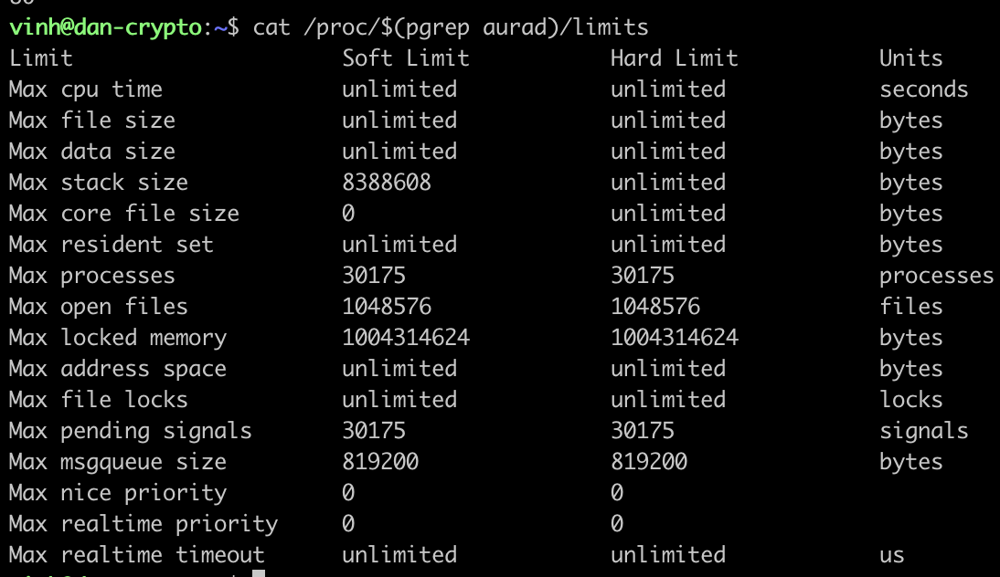

# File Descriptor

__Too many open files error__

A file descriptor is a unique identifier or a numerical index that is used to access files or input/output (I/O) resources in an operating system. Every process running on an operating system is assigned a set of file descriptors that represent its open files and I/O channels.

[file descriptor explaination on youtube](https://www.youtube.com/watch?v=KM5sRWAYqaw)

## Problem

A node periodically stops after sometimes due to error: "Too many open files" when it is commiting state to db in iavl.

The error is because that node holds too many open file descriptor compared to what it is allowed

```sh
sudo lsof -p $(pidof aurad)
```


```sh
sudo lsof -p $(pidof aurad) | wc -l
```

for the node process above, it maintains about 80 files

```sh
cat /proc/$(pgrep aurad)/limits
```



As you can see in the picture above, max open file is 1048576. In the above example, there is only 80 opened files which is smaller than 1048576. 

However, in the failed case that I observed on a terra node, the number of opened files goes up to 1000 which is larger than process open file limit. The default on most linux is 1024.
* The process may be unable to open a necessary db file, leading to data loss, corruption, or other errors.
* The process may be forced to close db files prematurely or use less efficient methods of managing file access in order to stay under the limit, which can reduce its performance.

Why terrad has so many files in the first place?
When Goleveldb performs a compaction, it creates new database files to replace the old ones. This is because the compaction process involves reading data from multiple smaller files and writing the merged data to new, larger files. The old files are then deleted to reclaim disk space.

Depending on the size and complexity of the database, a compaction operation in Goleveldb can create a large number of new database files. This is because the compaction process aims to optimize the organization of the data in the database, which can require creating multiple new files to achieve the desired result.

## Fix

To fix this problem, we have to increase file descriptor limit to accomodate with newly created db files. Google offers plenty of helpful answer:
* https://www.ibm.com/docs/en/rational-clearcase/9.0.2?topic=servers-increasing-number-file-handles-linux-workstations