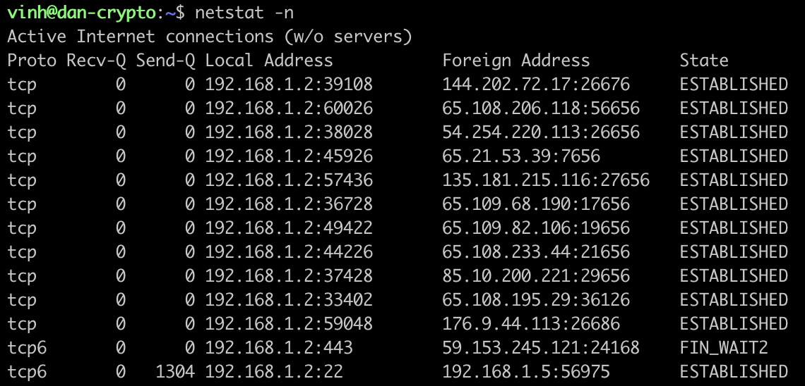
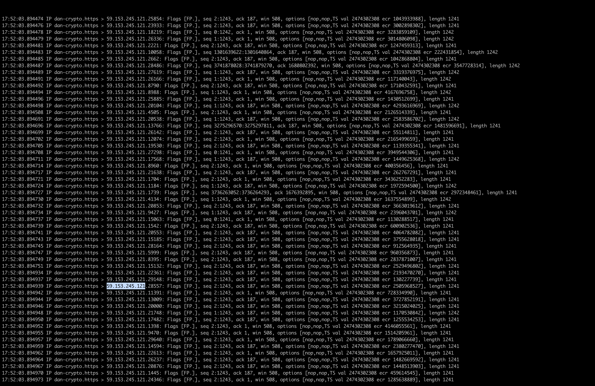

# P2P failure

failure log: [here](../assets/p2p_failure_log.txt)

this failure is rather dangerous because it is preventing node to talk to other nodes. Node will not be able to exchange votes thus no block producing. For a validator, this will lead to economic loss.

the reason lies in the fact that the node is being ddos.

the same attack can be done with following steps:
1. git clone https://github.com/nghuyenthevinh2000/go-cosmos-missile.git
2. increase rpc.grpc_max_open_connections to 10000 in config.toml
3. change target url to a rpc address in missle.go
4. change attackers number in main.go
5. go run *.go

## Fix
1. detect established connection `netstat -a | grep ':443'`

2. tcpdump -i eno1 port 443

it is all coming from 29.135.245.121

3. block 29.135.245.121 in firewall ufw, this is only temporary.
4. sentry nodes - validator architecture: https://hub.cosmos.network/main/validators/security.html#sentry-nodes-ddos-protection