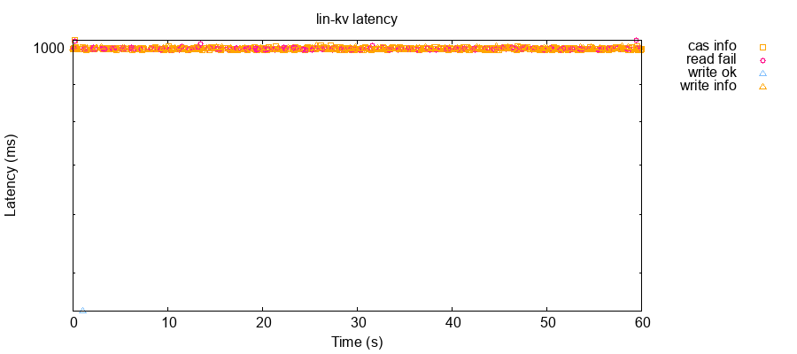
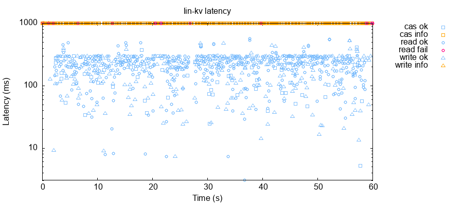

# RAFT consensus extremely low throughput

[problem source](https://github.com/nghuyenthevinh2000/distributed-training)

1. Slow elected leader: during my build of Raft consensus engine, I struggle with timing and synchronization. Due to locking mechanism, there can only be one operation in a time box. Other cannot join in. The more occurrence rate of an operation, the more chance for it to show up. In this sense, the higher client request rate, the smaller chance of a successful election. This is because the server reacts instantly to client request, the more of them, the more occurrence. Due to this, election operation has to wait for a very long time to get the chance to access resource. Additionally, they also need to collect votes from peers in a timely manner for a successful election. I need to localize resource locking and separate concerns

2. Log is synced, but no successful read (due to time - out): I am thinking maybe this is about wrong timing of read. But, would need to analyze more.
* time - out of read is about 1 sec, I need to serve read more quickly instead of waiting for log append. Maybe if before a read in uncommitted log, there is no write or cas, we can return read answer immediately up until there is a write or cas.
* when will leader handle logs? after replicating logs and confirming success with followers. All of these actions will have to be done in less than 1 sec.
* I have tried with creating thread safe types for each specific resource, this is so that it will not lock up the whole Raft like in initial design, still, not responding fast enough.
* I need to design a way to benchmark bottlenecks.
* msg_id was wrong, I have corrected this. to reply to original msg_id
```
Received {"id":36,"src":"c14","dest":"n0","body":{"key":1,"from":1,"to":4,"type":"cas","msg_id":2}} at 1693593204984 ms

In this case, n0 was forwarding request to n1 with its own msg id

Sending {n0 n1 map[from:1 key:1 msg_id:1 src:c14 to:4 type:cas]} at 1693593204985 ms
Received {"id":71,"src":"n1","dest":"n0","body":{"in_reply_to":1,"type":"cas_ok"}} at 1693593206065 ms
Sending {n0 c14 map[in_reply_to:1 type:cas_ok]} at 1693593206065 ms
```
* Time taken to solve is too long: ~3.5s compared to allow 1s
```
Received {"id":135,"src":"c13","dest":"n1","body":{"key":2,"from":4,"to":2,"type":"cas","msg_id":5}} at 1693595103696 ms
Sending {n1 n0 map[from:4 key:2 msg_id:13 src:c13 to:2 type:cas]} at 1693595103696 ms

Received {"id":269,"src":"n0","dest":"n1","body":{"in_reply_to":13,"type":"cas_ok"}} at 1693595107186 ms

current request: map[from:4 key:2 msg_id:5 src:c13 to:2 type:cas]
Sending {n1 c13 map[in_reply_to:5 type:cas_ok]} at 1693595107186 ms
-> It takes 3.5s to solve from received to sending result

This is result from maelstrom
{:index 97, :time 4342684334, :type :invoke, :process 58, :f :cas, :value [2 [4 2]]}

{:index 120, :time 5348457417, :type :info, :process 58, :f :cas, :value [2 [4 2]], :error :net-timeout}
-> It takes ~1s to timeout

So, we need to reduce 3.5s to < 1s somehow
```
* When benchmarking time taken to process, the longer it runs, the slower it gets. What seems to be the cause here?
	* it is ~0ms to process within a function, maybe the latency is between rpc?
	* how long it takes for an op to be executed? from receiving request to sending response
	* when an op be executed?
	* the reason is because of faulty commit index, leading it to block an increasing size of log
 * Steps (I need to details step to determine bottlenecks for benchmarking): 
	 * a follower request is forwarded to leader (when added to leader log?)
	 * that request is appended to log, awaiting for replication (when such op is received for replication?)
	 * once confirmed replicated, that request is handled in batch (when an op is executed?) (this is where it takes most time) (90% of time) (this is due to incorrect increase of commit_index)
	 * answer is returned to invoker
* Commit index is not updated correctly to match_index. Under observation, each replication pushes commit index by 2 only, while replicated log contains about ~10 entries. Why?
```
"Key 16, to 3", type cas (27429ms) 

Append (155)

At 325, "Key 16, to 3" is handled (is it in the same 155?)
```
Commit index has problem, why it not commits directly at that time
Fuck, commit index is blocking the whole consensus engine, it increases only by 2. It turns out that this is the root.

OMG, I init array with len of kv, and then append, leading to [0 0 n0 n1], leading to lowered wrong median

Fixed, throughput has increased tremendously

```
// BEFORE
cas: count: 361, ok: 0, fail: 361
read: count: 179, ok: 0, fail: 179,
write: count: 179, ok: 2, fail: 177
```



```
// AFTER
cas: count: 498, ok: 79, fail: 419
read: count: 498, ok: 459, fail: 39,
write: count: 272, ok: 270, fail: 2
```

